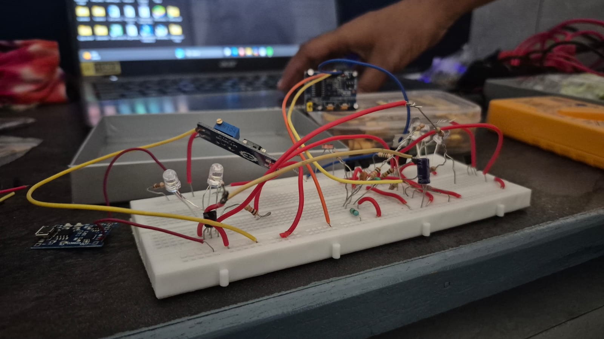
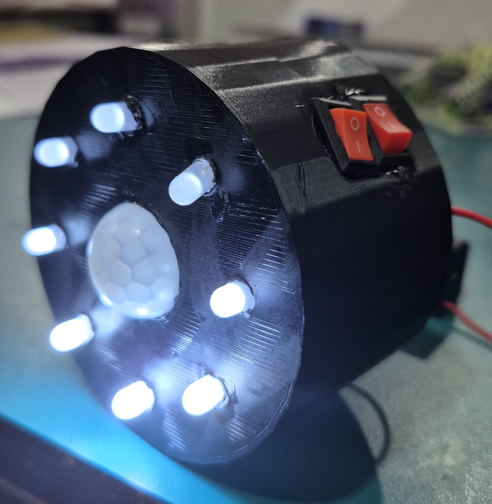

# Smart-Rechargeable-Motion-Sensing-Night-Light
A smart rechargeable motion sensing night light built without a microcontroller using an NE555 timer IC, PIR motion sensor, and USB Type-C charging module. The light automatically turns ON when motion is detected and switches OFF after a preset delay, providing an energy-efficient, portable, and cost-effective lighting solution.


## Overview

The **Smart Rechargeable Motion Sensing Light** is an automatic lighting system designed to provide convenient, energy-efficient illumination without the use of a microcontroller. The system detects human motion using a PIR (Passive Infrared) sensor and activates a group of LEDs through an NE555 Timer IC configured in monostable mode. Powered by a rechargeable battery and equipped with a Type-C charging module, the device offers a portable and practical lighting solution for indoor environments.

This project demonstrates the implementation of analog electronics, motion sensing, timer circuits, and rechargeable power management to create a reliable smart lighting system suitable for everyday use.

---

## Features

- Automatic motion detection using a PIR sensor
- Microcontroller-free design based on the NE555 Timer IC
- Rechargeable battery with USB Type-C charging support
- Automatic LED illumination for a preset duration
- Low power consumption
- Portable and compact design
- Simple and cost-effective implementation
- Suitable for beginners in electronics and embedded hardware

---

# Design Overview

The project consists of a PIR motion sensor, transistor switching stage, NE555 Timer configured in monostable mode, rechargeable battery, charging circuit, and LED lighting system.

### Block Diagram


---

### Circuit Diagram


---

## Working Principle

The system continuously monitors its surroundings using the PIR Motion Sensor.

1. During standby mode, the PIR sensor monitors for human movement while the LEDs remain OFF.
2. When motion is detected, the PIR sensor generates an output signal.
3. The transistor stage conditions the signal and triggers the NE555 Timer configured in monostable mode.
4. The timer output becomes HIGH for a predetermined duration.
5. The LEDs turn ON and illuminate the surrounding area.
6. The timing capacitor charges during the active period.
7. Once the preset delay expires and no additional motion is detected, the timer output returns LOW.
8. The LEDs switch OFF, returning the system to standby mode.
9. The rechargeable battery can be conveniently charged through the integrated USB Type-C charging module.

---

## Components Required

| Component | Quantity |
|-----------|---------:|
| PIR Motion Sensor (HC-SR501) | 1 |
| NE555 Timer IC | 1 |
| BC547 Transistors | 2 |
| Warm White LEDs | 2 |
| Cool White LEDs | 2 |
| 150Ω Resistors | 4 |
| 10kΩ Resistors | 2 |
| 100kΩ Resistor | 1 |
| 1kΩ Resistor | 1 |
| 100µF Capacitor | 1 |
| USB Type-C Charging Module | 1 |
| Rechargeable Battery | 1 |
| Slide Switch | 1 |
| PCB / General Purpose Board | 1 |
| Connecting Wires | As Required |

---

## Repository Structure

```
Smart-Rechargeable-Motion-Sensing-Light/
│
├── Block Diagram/
│   └── Block Diagram.jpg
│
├── Circuit Diagram/
│   └── Circuit Diagram.jpg
│
├── Documentation/
│   ├── PPT.pdf
│   └── Report.pdf
│
├── Images/
│   ├── Breadboard.jpg
│   ├── Prototype.jpg
│   ├── Prototype Circuit.jpg
│   ├── Final Circuit.jpg
│   └── Final Product.jpg
│
└── README.md
```

---

# Project Images

### Breadboard Setup



---

### Prototype



---

### Prototype Circuit


---

### Final Circuit


---

### Final Product


---

# Documentation

Detailed project documentation is available below:

- [Project Report](Documentation/Report.pdf)
- [Project Presentation](Documentation/PPT.pdf)

---

## Applications

This project can be used in a variety of indoor environments, including:

- Bedrooms
- Hallways
- Staircases
- Closets and Wardrobes
- Cabinets
- Study Rooms
- Hostels
- Smart Home Lighting
- Emergency Lighting
- Indoor Pathway Illumination

---

## Future Improvements

The project can be further enhanced with several additional features:

- Adjustable light brightness
- Ambient light sensing using an LDR
- Adjustable timer duration
- Solar charging support
- Higher-capacity rechargeable battery
- Low battery level indicator
- Compact custom PCB design
- Waterproof enclosure for outdoor use
- Magnetic wall mounting
- Automatic brightness adjustment based on surroundings

---

## Contributors

This project was developed by:

- **Shriya Pande**
- **Shruti Hirave**
- **Anushka Rani**

Third Year  
Department of Electronics and Telecommunication Engineering

---

## Acknowledgements

This project was developed as part of an academic electronics project to demonstrate the practical application of motion sensing, timer circuits, and rechargeable power systems using analog electronic components. It serves as an educational project for understanding sensor interfacing, timing circuits, transistor switching, and energy-efficient lighting solutions.

---

If you found this project helpful or interesting, consider giving the repository a **Star** on GitHub. Your support is greatly appreciated!
